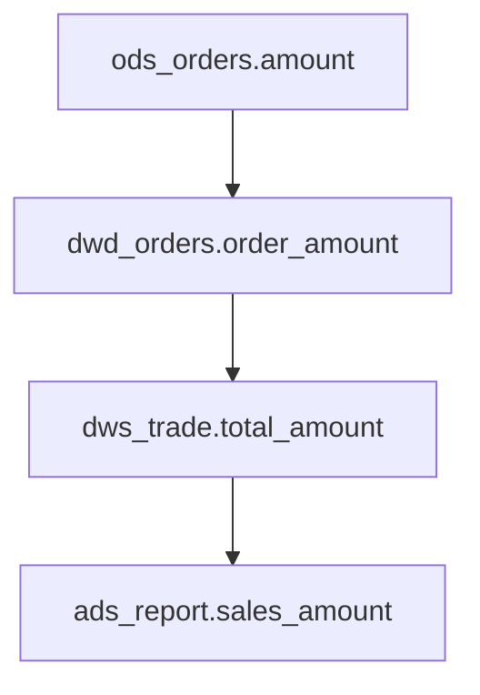

# 数仓血缘分析指南

## 1. 血缘类型定义

### 1.1 三层血缘

```
血缘层级架构:

┌─────────────────────────────────────────────────────────────────────────────┐
│                           字段级血缘（Level 3）                              │
│                                                                             │
│   ods_orders.amount ──┬──► dwd_orders.order_amount                        │
│                        ├──► dws_trade.total_amount                         │
│                        └──► ads_report.sales_amount                        │
│                                                                             │
├─────────────────────────────────────────────────────────────────────────────┤
│                           表级血缘（Level 1）                                │
│                                                                             │
│   ods_orders ──────► dwd_orders ──────► dws_trade ──────► ads_report        │
│                                                                             │
├─────────────────────────────────────────────────────────────────────────────┤
│                           任务级血缘（Level 2）                              │
│                                                                             │
│   task_ods_sync ────► task_dwd_transform ────► task_dws_agg ────► ...     │
│                                                                             │
└─────────────────────────────────────────────────────────────────────────────┘
```

### 1.2 血缘关系类型

| 关系类型 | 符号 | 说明 |
|---------|------|------|
| 直接依赖 | `──►` | 任务/表直接读取源数据 |
| 间接依赖 | `~~►` | 通过中间表传递 |
| 双向依赖 | `◄──►` | 循环依赖（问题） |
| 可选依赖 | `──?►` | 条件性依赖 |

---

## 2. SQL 血缘解析

### 2.1 解析核心逻辑

```python
"""
SQL 血缘解析器核心逻辑
"""
import re
from typing import List, Dict, Set
from dataclasses import dataclass

@dataclass
class FieldLineage:
    """字段级血缘"""
    target_field: str
    source_fields: List[str]
    transformation: str  # 直接映射/计算/聚合
    
@dataclass  
class TableLineage:
    """表级血缘"""
    target_table: str
    source_tables: List[str]
    join_conditions: List[str]
    
def parse_sql_lineage(sql: str) -> Dict:
    """
    解析 SQL 获取血缘关系
    
    Args:
        sql: SQL 语句
        
    Returns:
        {
            'target_table': str,
            'source_tables': list,
            'field_lineages': list,
            'join_conditions': list
        }
    """
    result = {
        'target_table': None,
        'source_tables': [],
        'field_lineages': [],
        'join_conditions': []
    }
    
    # 1. 提取目标表（INSERT/CREATE）
    insert_match = re.search(
        r'INSERT\s+(?:INTO\s+)?(?:TABLE\s+)?`?(\w+)`?\.',
        sql, re.IGNORECASE
    )
    create_match = re.search(
        r'CREATE\s+(?:TABLE\s+)?(?:IF\s+NOT\s+EXISTS\s+)?`?(\w+)`?',
        sql, re.IGNORECASE
    )
    
    if insert_match:
        result['target_table'] = insert_match.group(1)
    elif create_match:
        result['target_table'] = create_match.group(1)
    
    # 2. 提取源表（FROM/JOIN）
    from_match = re.search(
        r'FROM\s+`?(\w+)`?(?:\s+(?:AS\s+)?(\w+))?',
        sql, re.IGNORECASE
    )
    if from_match:
        result['source_tables'].append({
            'table': from_match.group(1),
            'alias': from_match.group(2) or from_match.group(1)
        })
    
    # 3. 提取 JOIN 表
    join_matches = re.finditer(
        r'(?:LEFT\s+|RIGHT\s+|INNER\s+|FULL\s+)?JOIN\s+`?(\w+)`?\s+(?:AS\s+)?(\w+)?',
        sql, re.IGNORECASE
    )
    for match in join_matches:
        result['source_tables'].append({
            'table': match.group(1),
            'alias': match.group(2) or match.group(1),
            'join_type': 'JOIN'
        })
    
    # 4. 提取字段血缘（简化版）
    select_match = re.search(r'SELECT\s+(.*?)\s+FROM', sql, re.IGNORECASE | re.DOTALL)
    if select_match:
        select_clause = select_match.group(1)
        fields = [f.strip() for f in select_clause.split(',')]
        for field in fields:
            if ' AS ' in field.upper():
                expr, alias = field.split(' AS ', 1)
                result['field_lineages'].append({
                    'target_field': alias.strip().strip('`'),
                    'source_expression': expr.strip(),
                    'type': 'calculated' if any(op in expr for op in ['SUM', 'COUNT', 'AVG', 'MAX', 'MIN', '+', '-', '*', '/']) else 'direct'
                })
    
    return result
```

### 2.2 字段级血缘追踪

```python
def trace_field_lineage(field_name: str, table: str, lineage_graph: Dict) -> List[Dict]:
    """
    追踪单个字段的完整血缘链
    
    Args:
        field_name: 字段名
        table: 所在表
        lineage_graph: 血缘图谱
        
    Returns:
        [
            {'table': 'ads_report', 'field': 'sales_amount'},
            {'table': 'dws_trade', 'field': 'total_amount'},
            {'table': 'dwd_orders', 'field': 'order_amount'},
            {'table': 'ods_orders', 'field': 'amount'}
        ]
    """
    lineage_chain = []
    current_table = table
    current_field = field_name
    
    # 向上追溯
    max_depth = 20  # 防止无限循环
    depth = 0
    
    while depth < max_depth:
        depth += 1
        
        if current_table not in lineage_graph:
            break
            
        table_info = lineage_graph[current_table]
        
        # 查找字段来源
        field_info = None
        for fl in table_info.get('field_lineages', []):
            if fl['target_field'] == current_field:
                field_info = fl
                break
        
        if not field_info:
            break
            
        lineage_chain.append({
            'table': current_table,
            'field': current_field,
            'type': field_info.get('type', 'unknown')
        })
        
        # 提取源字段
        source_expr = field_info.get('source_expression', '')
        
        # 如果是直接映射（如 field_name AS alias）
        if field_info.get('type') == 'direct':
            source_field = extract_source_field(source_expr)
            
            # 找到源表
            source_table = find_source_table(current_table, lineage_graph)
            
            if source_table and source_field:
                current_table = source_table
                current_field = source_field
            else:
                break
        else:
            # 计算字段，记录表达式后停止
            lineage_chain.append({
                'table': 'CALCULATED',
                'field': source_expr,
                'type': 'expression'
            })
            break
    
    return lineage_chain
```

---

## 3. 调度系统血缘提取

### 3.1 DataWorks 血缘提取

```python
"""
DataWorks 任务血缘提取
"""
import requests
from typing import List, Dict

class DataWorksLineageExtractor:
    
    def __init__(self, access_key: str, secret_key: str, project: str):
        self.access_key = access_key
        self.secret_key = secret_key
        self.project = project
        self.base_url = "https://dataworks.api.aliyun.com"
        
    def get_task_dependencies(self, task_id: str) -> Dict:
        """
        获取任务依赖关系
        
        Returns:
            {
                'task_id': str,
                'upstream_tasks': list,
                'downstream_tasks': list
            }
        """
        # 调用 DataWorks API
        response = requests.get(
            f"{self.base_url}/tasks/{task_id}/dependencies",
            headers=self._get_auth_headers()
        )
        
        return response.json()
    
    def get_task_lineage(self, task_id: str) -> Dict:
        """
        获取任务的数据血缘
        
        Returns:
            {
                'task_id': str,
                'source_tables': list,
                'target_tables': list,
                'source_fields': list,
                'target_fields': list
            }
        """
        # 1. 获取任务代码
        task_code = self._get_task_code(task_id)
        
        # 2. 解析 SQL 获取表级血缘
        table_lineage = self._parse_sql_tables(task_code)
        
        # 3. 解析字段级血缘
        field_lineage = self._parse_sql_fields(task_code)
        
        return {
            'task_id': task_id,
            'source_tables': table_lineage['source_tables'],
            'target_tables': table_lineage['target_tables'],
            'field_lineages': field_lineage
        }
    
    def build_lineage_graph(self) -> Dict:
        """
        构建完整血缘图谱
        """
        tasks = self._list_all_tasks()
        
        graph = {
            'tables': {},  # 表级血缘
            'tasks': {},   # 任务级血缘
            'fields': {}   # 字段级血缘
        }
        
        for task in tasks:
            lineage = self.get_task_lineage(task['id'])
            
            # 记录任务级血缘
            graph['tasks'][task['id']] = {
                'name': task['name'],
                'upstream': lineage['source_tables'],
                'downstream': lineage['target_tables']
            }
            
            # 记录表级血缘
            for target in lineage['target_tables']:
                if target not in graph['tables']:
                    graph['tables'][target] = {'upstream': [], 'downstream': []}
                graph['tables'][target]['upstream'].extend(lineage['source_tables'])
                
            for source in lineage['source_tables']:
                if source not in graph['tables']:
                    graph['tables'][source] = {'upstream': [], 'downstream': []}
                graph['tables'][source]['downstream'].extend(lineage['target_tables'])
        
        return graph
```

### 3.2 DolphinScheduler 血缘提取

```python
"""
DolphinScheduler 任务血缘提取
"""
import requests

class DolphinSchedulerLineageExtractor:
    
    def __init__(self, api_url: str, token: str):
        self.api_url = api_url
        self.token = token
        
    def get_process_definition(self, process_id: int) -> Dict:
        """
        获取工作流定义
        """
        response = requests.get(
            f"{self.api_url}/projects/{self.project_id}/processDefinition/{process_id}",
            headers={"token": self.token}
        )
        return response.json()
    
    def get_task_relations(self, process_id: int) -> List[Dict]:
        """
        获取任务依赖关系
        """
        response = requests.get(
            f"{self.api_url}/projects/{self.project_id}/processDefinition/{process_id}/taskRelations",
            headers={"token": self.token}
        )
        
        relations = []
        for relation in response.json()['data']:
            relations.append({
                'pre_task': relation['preTaskCode'],
                'post_task': relation['postTaskCode'],
                'condition': relation.get('condition', '')
            })
        
        return relations
    
    def build_task_dag(self, process_id: int) -> Dict:
        """
        构建 DAG 图
        """
        relations = self.get_task_relations(process_id)
        
        dag = {'nodes': [], 'edges': []}
        
        # 收集所有任务节点
        tasks = set()
        for r in relations:
            tasks.add(r['pre_task'])
            tasks.add(r['post_task'])
            
        dag['nodes'] = list(tasks)
        dag['edges'] = relations
        
        return dag
```

---

## 4. 影响分析

### 4.1 影响范围计算

```python
def calculate_impact_scope(
    change_table: str, 
    change_type: str,
    lineage_graph: Dict
) -> Dict:
    """
    计算变更影响范围
    
    Args:
        change_table: 变更表名
        change_type: 变更类型（DELETE/MODIFY/RENAME）
        lineage_graph: 血缘图谱
        
    Returns:
        {
            'direct_impact': list,    # 直接影响
            'indirect_impact': list,  # 间接影响
            'affected_reports': list,  # 受影响报表
            'affected_users': list,    # 受影响用户
            'risk_level': str         # 风险等级
        }
    """
    result = {
        'direct_impact': [],
        'indirect_impact': [],
        'affected_reports': [],
        'affected_users': [],
        'risk_level': 'low'
    }
    
    # 1. 直接影响（一层下游）
    if change_table in lineage_graph['tables']:
        result['direct_impact'] = lineage_graph['tables'][change_table].get('downstream', [])
    
    # 2. 间接影响（多层下游）
    visited = set()
    queue = result['direct_impact'].copy()
    
    while queue:
        current = queue.pop(0)
        if current in visited:
            continue
        visited.add(current)
        
        if current in lineage_graph['tables']:
            downstream = lineage_graph['tables'][current].get('downstream', [])
            result['indirect_impact'].extend(downstream)
            queue.extend(downstream)
    
    result['indirect_impact'] = list(set(result['indirect_impact']) - set(result['direct_impact']))
    
    # 3. 受影响报表
    for table in result['direct_impact'] + result['indirect_impact']:
        if table in lineage_graph.get('reports', {}):
            result['affected_reports'].extend(lineage_graph['reports'][table])
    
    # 4. 风险评估
    if len(result['affected_reports']) > 5:
        result['risk_level'] = 'high'
    elif len(result['affected_reports']) > 0:
        result['risk_level'] = 'medium'
    
    return result
```

### 4.2 影响报告生成

```yaml
# impact_report.yaml
report_metadata:
  generated_at: "{生成时间}"
  change_request: "{变更申请ID}"

change_summary:
  type: "{变更类型}"
  object: "{变更对象}"
  description: "{变更描述}"
  
impact_analysis:
  
  direct_impact:
    tables:
      - name: "{表名}"
        layer: "{层级}"
        domain: "{数据域}"
        impact_type: "{影响类型}"
        
    tasks:
      - name: "{任务名}"
        owner: "{负责人}"
        impact_type: "{需要修改}"
        
  indirect_impact:
    tables:
      - name: "{表名}"
        path: ["{上游表}", "{中间表}", "{当前表}"]
        
    reports:
      - name: "{报表名}"
        importance: "{核心/重要/一般}"
        users: ["{使用部门}"]
        
risk_assessment:
  level: "{高/中/低}"
  score: {风险分数}
  factors:
    - "{风险因素1}"
    - "{风险因素2}"
    
recommendations:
  - "{建议1}"
  - "{建议2}"
```

---

## 5. 血缘可视化

### 5.1 Mermaid 图生成

```python
def generate_mermaid_lineage(lineage_chain: List[Dict]) -> str:
    """
    生成 Mermaid 格式的血缘图
    
    Args:
        lineage_chain: 血缘链
        
    Returns:
        Mermaid 图代码
    """
    mermaid = "```mermaid\ngraph TD\n"
    
    # 添加节点
    for i, node in enumerate(lineage_chain):
        node_id = f"T{i}"
        label = f"{node['table']}.{node.get('field', '*')}"
        mermaid += f"    {node_id}[\"{label}\"]\n"
    
    # 添加边
    for i in range(len(lineage_chain) - 1):
        mermaid += f"    T{i} --> T{i+1}\n"
    
    mermaid += "```"
    
    return mermaid
```

### 5.2 示例输出



---

## 6. 血缘分析检查清单

```markdown
## 血缘分析检查清单

### 表级血缘
- [ ] 是否能追溯每张表的数据来源？
- [ ] 是否能识别每张表的数据去向？
- [ ] 是否存在循环依赖？
- [ ] 是否存在跨层依赖？

### 任务级血缘
- [ ] 任务依赖关系是否清晰？
- [ ] 任务链路深度是否合理（< 10 层）？
- [ ] 是否存在任务孤岛？

### 字段级血缘
- [ ] 核心指标是否可追溯来源？
- [ ] 字段口径是否一致？
- [ ] 是否存在字段映射错误？

### 影响分析
- [ ] 变更前是否进行影响评估？
- [ ] 下游用户是否知晓变更？
- [ ] 是否有回滚预案？
```
