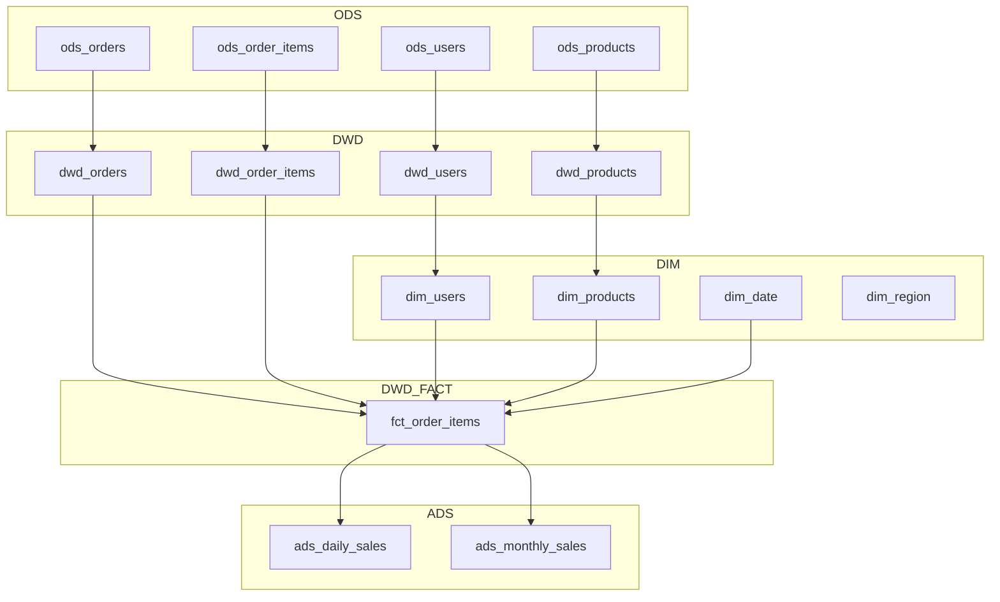

# 示例：电商数据仓库建模完整流程

## 场景描述

为电商业务建立数据仓库，支持销售分析、用户行为分析、商品分析。

> **本示例采用 OneData + Kimball 协作流程**：
> - **阶段0（OneData）**：数据域划分 → 业务过程识别 → 总线矩阵 → 指标体系（自顶向下规划）
> - **阶段1（Kimball）**：事实表设计 → 维度表设计 → SCD策略（自底向上设计）
> - **阶段2**：分层落地（ODS → DWD → DWS → ADS + DIM）

---

## 阶段0：OneData 自顶向下规划

### 0.1 数据域划分

```yaml
data_domains:
  - name: "用户域"
    code: "user"
    business_processes: ["注册", "登录", "等级变更", "注销"]
    priority: "P0"
    
  - name: "交易域"
    code: "trade"
    business_processes: ["下单", "支付", "退款", "发货", "收货"]
    priority: "P0"
    
  - name: "商品域"
    code: "product"
    business_processes: ["上架", "改价", "评价"]
    priority: "P0"
    
  - name: "流量域"
    code: "traffic"
    business_processes: ["浏览", "点击", "加购", "搜索"]
    priority: "P1"
```

### 0.2 业务过程清单

```yaml
business_processes:
  - name: "下单"
    domain: "交易域"
    grain: "订单项级别"
    source_tables: ["ods_orders", "ods_order_items"]
    
  - name: "支付"
    domain: "交易域"
    grain: "支付单级别"
    source_tables: ["ods_payments"]
    
  - name: "退款"
    domain: "交易域"
    grain: "退款单级别"
    source_tables: ["ods_refunds"]
    
  - name: "注册"
    domain: "用户域"
    grain: "用户级别"
    source_tables: ["ods_users"]
    
  - name: "浏览"
    domain: "流量域"
    grain: "浏览事件级别"
    source_tables: ["ods_page_views"]
```

### 0.3 总线矩阵

```
                  日期  用户  商品  地区  渠道  店铺
业务过程\维度      ────  ────  ────  ────  ────  ────
下单              ✓     ✓     ✓     ✓     ✓     ✓
支付              ✓     ✓     -     ✓     ✓     -
退款              ✓     ✓     ✓     -     -     ✓
注册              ✓     ✓     -     ✓     ✓     -
浏览              ✓     ✓     ✓     -     ✓     -
加购              ✓     ✓     ✓     -     ✓     -
```

**派生结论**：
- 一致性维度：`dim_user` / `dim_product` / `dim_date` / `dim_region` / `dim_channel` / `dim_store`
- 核心事实表：`fct_order_items` / `fct_pay` / `fct_refund` / `fct_user_register` / `fct_page_view`

### 0.4 指标字典

```yaml
atomic_metrics:
  - code: "AT_001"
    name: "支付金额"
    business_process: "支付"
    measure: { aggregation: "SUM", source_field: "ods_payments.pay_amount" }
    filter: "status = 'paid'"
    
  - code: "AT_002"
    name: "订单数"
    business_process: "下单"
    measure: { aggregation: "COUNT", source_field: "ods_orders.order_id" }
    filter: "status != 'cancelled'"
    
  - code: "AT_003"
    name: "新注册用户数"
    business_process: "注册"
    measure: { aggregation: "COUNT", source_field: "ods_users.user_id" }
    filter: "is_new = TRUE"

derived_metrics:
  - code: "DR_001"
    name: "最近7天广东支付金额"
    atomic_metric: "AT_001"
    modifiers: [{ region: "广东省" }, { time_window: "7d" }]
    
  - code: "DR_002"
    name: "最近30天iOS新注册用户数"
    atomic_metric: "AT_003"
    modifiers: [{ platform: "iOS" }, { time_window: "30d" }]

composite_metrics:
  - code: "CO_001"
    name: "客单价"
    formula: "AT_001 / AT_002"
    description: "每个订单的平均支付金额"
```

---

## 阶段1：模型设计

### 输入

```
/model-design
业务场景：电商订单销售流程
分析需求：
1. 销售趋势分析（按日/周/月/年）
2. 用户购买行为分析（新老用户、复购率）
3. 商品销售分析（热销商品、品类分析）
4. 地域销售分析

数据源：
- ods_orders：订单主表（1亿记录）
- ods_order_items：订单明细表（3亿记录）
- ods_users：用户表（1000万记录）
- ods_products：商品表（50万记录）
- ods_categories：类目表（1万记录）

特殊需求：
- 需要追踪用户等级变化历史
- 需要支持缓慢变化维度的商品信息
- 日增订单100万，保留3年历史数据
```

### 输出

```markdown
# 电商数据仓库模型设计方案

## 1. 业务背景

**业务流程**：用户浏览商品 → 下单 → 支付 → 发货 → 确认收货
**分析需求**：销售分析、用户分析、商品分析、地域分析
**数据规模**：日增100万订单，3年历史，总计约10亿订单项

## 2. 模型架构

采用星型模型，以订单项为最细粒度。

```
                              ┌─────────────┐
                              │   dim_date  │
                              └──────┬──────┘
                                     │
    ┌─────────────┐   ┌─────────────┼─────────────┐   ┌─────────────┐
    │  dim_user   │   │ dim_product │             │   │ dim_region  │
    │  (SCD2)     │   │   (SCD2)    │             │   │             │
    └──────┬──────┘   └──────┬──────┘             │   └──────┬──────┘
           │                 │                    │          │
           │                 │                    │          │
           └─────────────────┼────────────────────┴──────────┘
                             │
                       ┌─────┴─────────────┐
                       │ fct_order_items  │
                       │  (订单项事实表)    │
                       └───────────────────┘
```

## 3. 事实表设计

### fct_order_items（订单项事实表）

**粒度**：单个订单中的单个商品项

| 字段名 | 数据类型 | 说明 | 来源 |
|--------|----------|------|------|
| order_item_sk | BIGINT | 代理键（主键） | 生成 |
| date_key | INT | 日期外键 → dim_date | ods_orders.created_at |
| date_month | VARCHAR(6) | 月分区键（YYYYMM） | ods_orders.created_at |
| user_sk | BIGINT | 用户外键 → dim_user | ods_orders.user_id |
| product_sk | BIGINT | 商品外键 → dim_product | ods_order_items.product_id |
| region_sk | BIGINT | 地区外键 → dim_region | ods_users.city_code |
| order_id | VARCHAR(32) | 订单号（退化维度） | ods_orders.order_id |
| order_item_id | VARCHAR(32) | 订单项ID（退化维度） | ods_order_items.item_id |
| quantity | INT | 数量 | ods_order_items.quantity |
| unit_price | DECIMAL(10,2) | 单价 | ods_order_items.unit_price |
| discount_amount | DECIMAL(10,2) | 优惠金额 | 计算 |
| shipping_amount | DECIMAL(10,2) | 运费分摊 | 计算 |
| total_amount | DECIMAL(10,2) | 总金额 | 计算 |

**分区策略**：PARTITION BY VALUE(date_month) LIFECYCLE 36（AnalyticDB MySQL）
**分布键**：DISTRIBUTED BY HASH(order_item_sk)
**索引**：内联 INDEX(date_key)、INDEX(user_sk)、INDEX(product_sk)（ADB 不支持复合索引，每列单独建）+ CLUSTERED KEY(date_key, user_sk)

## 4. 维度表设计

### dim_user（用户维度表 - SCD Type 2）

| 字段名 | 类型 | 说明 | SCD类型 |
|--------|------|------|---------|
| user_sk | BIGINT PK | 代理键 | - |
| user_id | BIGINT | 用户自然键 | Type 0 |
| username | VARCHAR(50) | 用户名 | Type 2 |
| email | VARCHAR(100) | 邮箱 | Type 2 |
| phone | VARCHAR(20) | 手机号 | Type 2 |
| gender | VARCHAR(10) | 性别 | Type 2 |
| birth_date | DATE | 生日 | Type 0 |
| register_date | DATE | 注册日期 | Type 0 |
| user_level | VARCHAR(20) | 用户等级 | Type 2 |
| city_code | VARCHAR(10) | 城市代码 | Type 2 |
| city_name | VARCHAR(50) | 城市名称 | Type 2 |
| province_code | VARCHAR(10) | 省份代码 | Type 2 |
| province_name | VARCHAR(50) | 省份名称 | Type 2 |
| valid_from | DATE | 生效日期 | - |
| valid_to | DATE | 失效日期 | - |
| is_current | BOOLEAN | 是否当前版本 | - |

### dim_product（商品维度表 - SCD Type 2）

| 字段名 | 类型 | 说明 | SCD类型 |
|--------|------|------|---------|
| product_sk | BIGINT PK | 代理键 | - |
| product_id | BIGINT | 商品自然键 | Type 0 |
| product_name | VARCHAR(200) | 商品名称 | Type 2 |
| category_id | BIGINT | 类目ID | Type 2 |
| category_name | VARCHAR(100) | 类目名称 | Type 2 |
| brand_name | VARCHAR(100) | 品牌 | Type 2 |
| price | DECIMAL(10,2) | 标价 | Type 2 |
| valid_from | DATE | 生效日期 | - |
| valid_to | DATE | 失效日期 | - |
| is_current | BOOLEAN | 是否当前版本 | - |

### dim_region（地区维度表）

> 一致性维度，被 fct_order_items 通过 region_sk 引用，需显式定义。

| 字段名 | 类型 | 说明 |
|--------|------|------|
| region_sk | BIGINT PK | 代理键 |
| city_code | VARCHAR(10) | 城市代码（自然键） |
| city_name | VARCHAR(50) | 城市名称 |
| province_code | VARCHAR(10) | 省份代码 |
| province_name | VARCHAR(50) | 省份名称 |
| region_name | VARCHAR(64) | 大区名称（华北/华东/华南…） |
| region_code | VARCHAR(32) | 大区编码 |

### dim_date（日期维度表）

| 字段名 | 类型 | 说明 |
|--------|------|------|
| date_key | INT PK | 日期键 (YYYYMMDD) |
| date | DATE | 日期 |
| year | INT | 年 |
| quarter | INT | 季度 |
| month | INT | 月 |
| week | INT | 周 |
| day | INT | 日 |
| is_weekend | BOOLEAN | 是否周末 |
| is_holiday | BOOLEAN | 是否节假日 |

## 5. ETL映射关系

### 数据流

| 目标表 | 源表 | 转换逻辑 |
|--------|------|----------|
| fct_order_items | ods_orders + ods_order_items | JOIN关联，金额计算，代理键查找 |
| dim_user | ods_users | SCD Type 2处理，版本管理 |
| dim_product | ods_products + ods_categories | JOIN关联，SCD Type 2处理 |
| dim_region | ods_users（城市编码） | 城市/省份/大区映射，全量覆盖 |
| dim_date | 生成 | 预生成日期维度数据 |

### 加载策略

| 表 | 加载频率 | 加载方式 | 历史处理 |
|----|----------|----------|----------|
| fct_order_items | 每小时 | 增量 | 追加 |
| dim_user | 每日 | 增量+SCD | Type 2版本 |
| dim_product | 每日 | 增量+SCD | Type 2版本 |
| dim_region | 每日 | 全量覆盖 | 全量覆盖 |
| dim_date | 每年 | 全量 | 预生成10年 |

## 6. 物理设计建议

### 分区策略
```sql
-- 目标数据库：AnalyticDB MySQL
-- 按月分区（PARTITION BY VALUE），LIFECYCLE 36 个月自动过期
-- 建表时 DISTRIBUTED BY HASH 与 PARTITION BY VALUE 必须同时指定，
-- 主键必须包含分布键与分区键。
CREATE TABLE fct_order_items (
    order_item_sk BIGINT,
    date_key      INT          COMMENT 'YYYYMMDD',
    date_month    VARCHAR(6)   COMMENT 'YYYYMM 月分区键',
    user_sk       BIGINT,
    product_sk    BIGINT,
    order_id      VARCHAR(32),
    order_item_id VARCHAR(32),
    quantity      INT,
    total_amount  DECIMAL(18,2),
    PRIMARY KEY (order_item_sk, date_month),
    INDEX idx_fact_date(date_key),
    INDEX idx_fact_user(user_sk),
    INDEX idx_fact_product(product_sk),
    CLUSTERED KEY ck_fact_date_user(date_key, user_sk)
)
DISTRIBUTED BY HASH(order_item_sk)
PARTITION BY VALUE(date_month) LIFECYCLE 36;
```

### 索引策略
```sql
-- AnalyticDB MySQL 不支持独立 CREATE INDEX，索引在建表语句中内联声明：

-- 事实表（见上方 CREATE TABLE，已内联 INDEX 与 CLUSTERED KEY）

-- 维度表（建表时内联索引）
CREATE TABLE dim_user (
    user_id    BIGINT,
    user_sk    BIGINT,
    is_current BOOLEAN,
    -- ...其他字段
    PRIMARY KEY (user_sk, user_id),
    INDEX idx_dim_user_natural(user_id),
    INDEX idx_dim_user_current(is_current)  -- ADB 不支持复合索引，单列
)
DISTRIBUTED BY HASH(user_sk);
```

---

## 阶段2：SQL模型开发

### 2.1 生成Staging模型

> 项目已不使用 dbt。所有 Staging 模型直接读取 ODS 层表（ods_ 前缀），写入 DWD 层（dwd_ 前缀），不再使用 `{{ source() }}` / `{{ ref() }}`。

#### dwd_orders.sql（原 stg_orders）

```sql
/*
 * DWD: dwd_orders（原 stg_orders）
 * Source: ods_orders（直接表名，不再使用 dbt source/ref）
 * Description: 清洗后的订单主表数据
 */

WITH source AS (
    SELECT * FROM ods_orders
),

renamed AS (
    SELECT
        -- 主键
        order_id,

        -- 外键
        user_id,

        -- 属性
        order_status,
        payment_method,
        shipping_address,

        -- 数值
        order_amount,
        discount_amount,
        shipping_amount,
        total_amount,

        -- 时间戳
        created_at,
        updated_at,
        paid_at,
        shipped_at,
        delivered_at

    FROM source
    WHERE deleted_at IS NULL  -- 排除已删除订单
)

INSERT OVERWRITE TABLE dwd_orders
SELECT * FROM renamed;
```

对应的字段质量校验（替代 dbt schema tests）：
```yaml
# 数据质量校验配置（由 dq-assistant 执行，非 dbt tests）
table: dwd_orders
rules:
  - column: order_id
    checks: [not_null, unique]
  - column: user_id
    checks:
      - not_null
      - referential_integrity:
          to: dwd_users
          field: user_id
  - column: order_status
    checks:
      - not_null
      - accepted_values: ['pending', 'paid', 'shipped', 'delivered', 'cancelled', 'refunded']
  - column: total_amount
    checks: [not_null]
```

#### dwd_order_items.sql（原 stg_order_items）

```sql
/*
 * DWD: dwd_order_items（原 stg_order_items）
 * Source: ods_order_items（直接表名，不再使用 dbt source/ref）
 * Description: 清洗后的订单明细数据
 */

WITH source AS (
    SELECT * FROM ods_order_items
),

renamed AS (
    SELECT
        item_id AS order_item_id,
        order_id,
        product_id,
        quantity,
        unit_price,
        discount_amount,
        (quantity * unit_price - discount_amount) AS item_total,
        created_at

    FROM source
)

INSERT OVERWRITE TABLE dwd_order_items
SELECT * FROM renamed;
```

### 2.2 生成Dimension模型

#### dim_users.sql (SCD Type 2)

```sql
/*
 * Dimension: dim_users
 * Grain: One row per user per version
 * SCD Type: Type 2 (保留历史)
 * Source: dwd_users（直接表名，不再使用 dbt ref）
 */

WITH source AS (
    SELECT * FROM dwd_users
),

-- 检测变化的记录
changes AS (
    SELECT
        user_id,
        username,
        email,
        phone,
        user_level,
        city_code,
        city_name,
        province_code,
        province_name,
        updated_at,

        -- 获取上一版本的关键字段
        LAG(user_level) OVER (PARTITION BY user_id ORDER BY updated_at) AS prev_level,
        LAG(city_code) OVER (PARTITION BY user_id ORDER BY updated_at) AS prev_city,

        -- 标记是否变化
        CASE
            WHEN user_level != LAG(user_level) OVER (PARTITION BY user_id ORDER BY updated_at)
              OR city_code != LAG(city_code) OVER (PARTITION BY user_id ORDER BY updated_at)
            THEN TRUE
            ELSE FALSE
        END AS has_changed,

        -- 行号用于版本控制
        ROW_NUMBER() OVER (PARTITION BY user_id ORDER BY updated_at) AS version_num

    FROM source
),

-- SCD Type 2 处理
scd AS (
    SELECT
        -- ADB MySQL 用 CAST AS CHAR（非 STRING）；MD5 产出 VARCHAR(32)，实际使用需配合 CRC32 或改 DDL 为 VARCHAR(32)
        MD5(CONCAT(CAST(user_id AS CHAR), CAST(version_num AS CHAR))) AS user_sk,
        user_id,
        username,
        email,
        phone,
        user_level,
        city_code,
        city_name,
        province_code,
        province_name,
        updated_at AS valid_from,
        COALESCE(
            LEAD(updated_at) OVER (PARTITION BY user_id ORDER BY updated_at),
            CAST('9999-12-31 00:00:00' AS TIMESTAMP)
        ) AS valid_to,
        CASE
            WHEN LEAD(updated_at) OVER (PARTITION BY user_id ORDER BY updated_at) IS NULL
            THEN TRUE
            ELSE FALSE
        END AS is_current

    FROM changes
    WHERE version_num = 1 OR has_changed = TRUE
)

INSERT OVERWRITE TABLE dim_users
SELECT * FROM scd;
```

### 2.3 生成Fact模型

#### fct_order_items.sql

```sql
/*
 * Fact: fct_order_items
 * Grain: One row per order line item
 * Description: 订单项事实表
 * Source: dwd_orders / dwd_order_items / dim_users / dim_products（直接表名，不再使用 dbt ref）
 */

WITH dwd_orders AS (
    SELECT * FROM dwd_orders
),

dwd_order_items AS (
    SELECT * FROM dwd_order_items
),

-- 关联订单和订单明细
order_items AS (
    SELECT
        oi.order_item_id,
        o.order_id,
        o.user_id,
        oi.product_id,
        DATE(o.created_at) AS order_date,
        DATE_FORMAT(o.created_at, '%Y%m') AS date_month,
        o.order_status,
        oi.quantity,
        oi.unit_price,
        oi.discount_amount,
        oi.item_total,
        -- 运费分摊（简化处理：按金额比例分摊）
        ROUND(o.shipping_amount * oi.item_total / o.total_amount, 2) AS shipping_amount

    FROM dwd_order_items oi
    JOIN dwd_orders o ON oi.order_id = o.order_id
    WHERE o.order_status NOT IN ('cancelled', 'refunded')  -- 排除取消/退款订单
),

final AS (
    SELECT
        -- 代理键
        MD5(CONCAT(CAST(oi.order_item_id AS CHAR))) AS order_item_sk,

        -- 维度外键（使用当前版本的维度）
        CAST(DATE_FORMAT(oi.order_date, '%Y%m%d') AS INT) AS date_key,
        oi.date_month,
        u.user_sk,
        p.product_sk,

        -- 退化维度
        oi.order_id,
        oi.order_item_id,
        oi.order_status,

        -- 度量
        oi.quantity,
        oi.unit_price,
        oi.discount_amount,
        oi.shipping_amount,
        oi.item_total AS total_amount,

        -- 审计字段
        CURRENT_TIMESTAMP AS loaded_at

    FROM order_items oi
    LEFT JOIN dim_users u
        ON oi.user_id = u.user_id
        AND u.is_current = TRUE
    LEFT JOIN dim_products p
        ON oi.product_id = p.product_id
        AND p.is_current = TRUE
)

INSERT OVERWRITE TABLE fct_order_items
SELECT * FROM final;
```

---

## 阶段3：血缘分析

### 输入

```
/lineage-scan 分析 fct_order_items 的完整血缘关系（注：血缘扫描由 dw-refactor-assistant 模块提供）
```

### 输出

```markdown
# 数据血缘文档 - fct_order_items

## 概览

| 属性 | 值 |
|------|-----|
| 模型名 | fct_order_items |
| 模型类型 | Fact Table |
| 上游依赖 | 5张直接依赖表 + 2张间接依赖表 |
| 下游消费 | 3个下游模型 |
| 血缘深度 | 3层（ODS → DWD/DIM → DWD_FACT） |

## 血缘概览图



## 详细血缘

### 上游依赖

#### 第一层依赖（直接依赖）

| 表名 | 类型 | Join类型 | 字段映射 |
|------|------|----------|----------|
| dwd_orders | 物理表 | INNER JOIN | order_id → order_id |
| dwd_order_items | 物理表 | INNER JOIN | order_item_id → order_item_id |
| dim_users | 物理表 | LEFT JOIN | user_id → user_sk |
| dim_products | 物理表 | LEFT JOIN | product_id → product_sk |
| dim_date | 物理表 | LEFT JOIN | order_date → date_key |

#### 第二层依赖（间接依赖）

| 表名 | 类型 | 被谁依赖 |
|------|------|----------|
| dwd_users | 物理表 | dim_users |
| dwd_products | 物理表 | dim_products |

#### 第三层依赖（ODS层）

| 表名 | 类型 | 被谁依赖 |
|------|------|----------|
| ods_orders | ODS源表 | dwd_orders |
| ods_order_items | ODS源表 | dwd_order_items |
| ods_users | ODS源表 | dwd_users |
| ods_products | ODS源表 | dwd_products |

### 下游消费

| 表名 | 类型 | 说明 |
|------|------|------|
| ads_daily_sales | 物理表 | 日销售汇总 |
| ads_monthly_sales | 物理表 | 月销售汇总 |
| rpt_sales_dashboard | 物理表 | 销售报表 |

## 字段级血缘

| 目标字段 | 源表 | 源字段 | 转换 |
|----------|------|--------|------|
| order_item_sk | - | order_item_id | MD5(CONCAT(...)) 代理键 |
| order_id | dwd_orders | order_id | 直接映射 |
| user_sk | dim_users | user_sk | 代理键查找 |
| quantity | dwd_order_items | quantity | 直接映射 |
| total_amount | dwd_order_items | item_total | 直接映射 |
| loaded_at | - | - | CURRENT_TIMESTAMP |

## 影响分析

### 如果修改 fct_order_items，将影响：

1. **ads_daily_sales** - 日销售汇总（重要）
2. **ads_monthly_sales** - 月销售汇总（重要）
3. **rpt_sales_dashboard** - 销售报表（重要）

**建议**：修改前需通知下游使用者，并在测试环境充分验证。

### 如果上游 ods_orders 变更，将影响：

1. dwd_orders
2. fct_order_items
3. ads_daily_sales, ads_monthly_sales, rpt_sales_dashboard

**建议**：ODS源表层变更需格外谨慎，建议通过数据合约管理。
```

---

## 完整工作流程总结

```
━━━━━━━━━━━━━━━━━━━━━━━━━━━━━━━━━━━━━━━━━━━━━━━━━━━━━━━━━━━━
电商数据仓库建模流程
━━━━━━━━━━━━━━━━━━━━━━━━━━━━━━━━━━━━━━━━━━━━━━━━━━━━━━━━━━━━

阶段1: 模型设计 (2小时)
├─ 业务需求分析
├─ 确定粒度：订单项级别
├─ 识别维度：用户、商品、日期、地区
├─ 设计4个维度表（SCD Type 2）
└─ 设计1个事实表

阶段2: SQL模型开发 (4小时)
├─ DWD模型：4个（dwd_orders, dwd_order_items, dwd_users, dwd_products）
├─ Dimension模型：4个（dim_users, dim_products, dim_date, dim_region）
├─ Fact模型：1个（fct_order_items）
└─ 数据质量校验配置

阶段3: 血缘文档 (30分钟)
├─ 表级血缘分析
├─ 字段级血缘映射
├─ 影响分析
└─ 可视化血缘图

总耗时: 约6.5小时
━━━━━━━━━━━━━━━━━━━━━━━━━━━━━━━━━━━━━━━━━━━━━━━━━━━━━━━━━━━━

产出物:
✅ 完整模型设计方案
✅ 9个SQL模型
✅ 完整的测试配置
✅ 血缘分析文档
```

---

## 部署清单

### 模型清单

> 项目不再使用 dbt，所有模型为物理表（AnalyticDB MySQL / MaxCompute），由 DataWorks 调度 ETL 任务产出；不再有 view/seed/incremental 的 dbt 物化类型。

| 层级 | 模型名 | 物化类型 | 优先级 |
|------|--------|----------|--------|
| DWD | dwd_orders | 物理表（每日全量覆盖） | 高 |
| DWD | dwd_order_items | 物理表（每日全量覆盖） | 高 |
| DWD | dwd_users | 物理表（每日全量覆盖） | 高 |
| DWD | dwd_products | 物理表（每日全量覆盖） | 高 |
| DIM | dim_users | 物理表（增量 SCD2） | 高 |
| DIM | dim_products | 物理表（增量 SCD2） | 高 |
| DIM | dim_date | 物理表（预生成 10 年） | 中 |
| DIM | dim_region | 物理表（全量覆盖） | 中 |
| DWD_FACT | fct_order_items | 物理表（分区 + 增量） | 高 |

### 部署顺序

```
1. DIM 预生成（dim_date, dim_region）
2. DWD（所有 dwd_*）
3. DIM 依赖 DWD（dim_users, dim_products）
4. DWD_FACT（fct_order_items）
```
